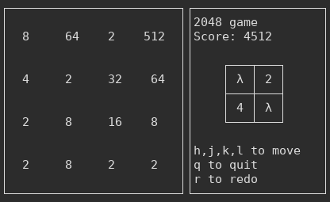

# 2048 game
A 2048 clone in Haskell.

## Screenshot


## Installation

Download a stable version [here](https://gitlab.com/gRastello/2048game/tags) or clone this repository (for the tesing one) extract it, cd into it and then run:

```cabal install```

You can then launch the game with the ```2048game``` command from a terminal.

## How to play

| Command | Action            |
|---------|-------------------|
| h,j,k,l | left,down,up,right|
| q       | quit              |
| r       | restart           |
